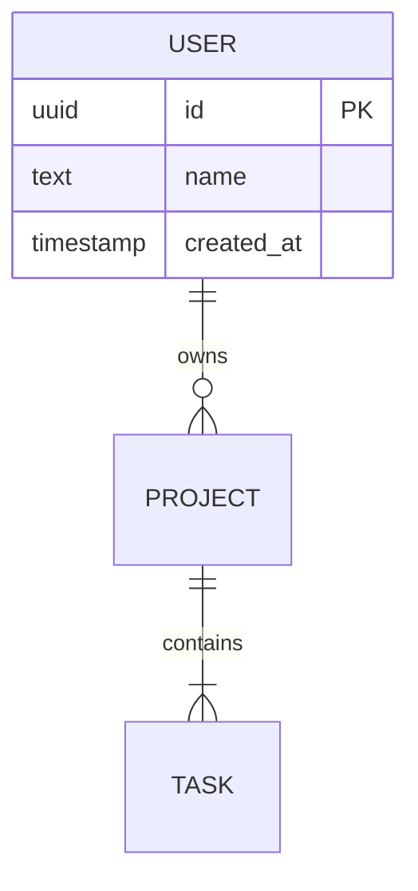

# Architecture Rules

> Loaded by `/architecture` workflow. Defines the required template and conventions for `architecture.md`.

## 1. Required Sections

Every project's `architecture.md` must contain these sections:

1. **Project Overview** — name, purpose, high-level description
2. **Project Objectives & Key Features** — overarching goals, key capabilities, target audience, and non-goals
3. **Language & Runtime** — edition, toolchain version, minimum supported
4. **Project Layout** — directory tree with one-line purpose per directory
5. **Module Boundaries** — for each module:
   - **Owns**: what this module is responsible for
   - **Does NOT own**: what's delegated to other modules
   - **Trait Interfaces**: traits used for inter-module dependencies
   - **Mock Availability**: whether a mock implementation exists for testing
6. **Dependency Direction Rules** — table: Module → May Import → Must NOT Import
7. **Toolchain** — formatter, linter, test runner, build tool, verification commands
8. **Error Handling Strategy** — crate choices, error propagation pattern, per-module error types
9. **Observability & Logging** — framework, log levels, instrumentation approach
10. **Testing Strategy** — unit/integration/doc test locations, coverage expectations
11. **Documentation Conventions** — doc comment style, module docs requirement
12. **Dependencies & External Systems** — key crates, external APIs, databases
13. **Architecture Diagrams** — Mermaid: module graph, data flow, error flow
14. **Known Constraints & Technical Debt** — limitations, workarounds, planned fixes
15. **Data Model** *(if persistent storage)* — tables/collections, relationships, ERD diagram, migration strategy
16. **Environment Configuration** *(if external services)* — .env hierarchy, config struct, deployment environments, Docker compose setup

## 2. Objectives & Key Features Conventions

Define the project's strategic context. Subsections:

| Subsection | Purpose |
|------------|--------|
| **Primary Objectives** | 3–5 bullets defining what the project aims to achieve |
| **Key Features** | Core capabilities the project delivers |
| **Target Users / Audience** | Who this is built for |
| **Non-Goals** *(optional)* | What the project explicitly does NOT aim to do — useful for scoping |

> [!TIP]
> Non-Goals are optional for small projects but highly recommended for multi-purpose or enterprise projects.

## 3. Module Boundary Conventions

- Every module must have explicit Owns / Does NOT own declarations.
- Shared types belong in a dedicated `types` or `common` module.
- Database access must be isolated behind Repository traits.
- Cross-module dependencies must use trait interfaces; concrete implementations are injected, not imported directly.
- For each inter-module dependency, specify: trait name, concrete implementation, and whether a mock implementation exists.
- Mockability is a design-time decision — if a boundary can't be mocked, the architecture must justify why.

## 4. Dependency Direction Rules

- Document as a table:

| Module | May Import | Must NOT Import |
|--------|-----------|-----------------|
| `handler` | `service`, `types` | `db`, `infra` |
| `service` | `repository` (trait), `types` | `db` (concrete), `handler` |
| `repository` | `db`, `types` | `handler`, `service` |

- Direction must be acyclic (no circular dependencies).
- Infrastructure modules (db, network, filesystem) at the bottom.
- Handlers and entry points at the top.

## 5. Diagram Conventions

- **Module interaction diagram** — required for all projects. Shows modules as nodes, edges labeled with relationship type (calls, owns, implements).
- **Data flow diagram** — required for multi-module projects. Shows how data moves from entry point to storage.
- **Entity-Relationship diagram** — required for projects with data models. Shows tables/collections, columns/fields, relationships (1:1, 1:N, N:M). Use Mermaid `erDiagram` blocks.
- **Error propagation diagram** — recommended. Shows how errors map across module boundaries.
- Use Mermaid format. Quote node labels containing special characters.
- Label edges with the trait or function used for the interaction.

## 6. When to Use

| Scenario | Workflow | Output |
|----------|----------|--------|
| No architecture.md exists | `/architecture` | `architecture.md` (new) |
| Major restructuring needed | `/architecture` | `architecture.md` (rewrite) |
| Audit existing architecture | `/architecture` | Recommendations Report |
| Small doc sync after code change | `/update-doc` | `architecture.md` (patch) |

## 7. Data Model Conventions *(if persistent storage)*

Required when the project uses any persistent storage: SQL, NoSQL, embedded DB, or structured files.

### Schema Documentation

For each table/collection:

| Column | Type | Constraints | Notes |
|--------|------|-------------|-------|
| `id` | UUID | PK | Auto-generated |
| `name` | TEXT | NOT NULL, UNIQUE | — |
| `created_at` | TIMESTAMP | NOT NULL, DEFAULT now() | — |

### Relationship Conventions

- FK naming: `{referenced_table}_id` (e.g., `user_id`, `project_id`)
- Junction tables for N:M: `{table_a}_{table_b}` (alphabetical order)
- Document cascade rules (ON DELETE CASCADE/SET NULL/RESTRICT)
- Prefer soft deletes (`deleted_at` column) over hard deletes where appropriate

### ERD Format

Use Mermaid `erDiagram` blocks:



### Migration Strategy

- **Tool**: document which migration tool is used (sqlx, diesel, goose, prisma, etc.)
- **Naming**: `YYYYMMDD_HHMMSS_description` (e.g., `20260226_120000_add_projects_table`)
- **Rollback**: every migration must have a corresponding down/rollback
- **State tracking**: document where migration state is stored

### Naming Conventions

- `snake_case` for tables and columns
- Singular table names (`user`, not `users`)
- Consistent prefix/suffix patterns per project (document in architecture.md)

## 8. Best Practices *(advisory, not required)*

These are common patterns the Architect should consider. Projects may deviate with justification.

- **Layer separation**: handler → service → repository → db. Each layer only depends on the one below.
- **Trait-based boundaries**: Define traits at module boundaries. Accept `impl Trait` or `dyn Trait`, not concrete types. This enables mock injection for testing.
- **Error isolation**: Each module defines its own error enum. Errors are mapped at module boundaries via `From` impls or `.map_err()`.
- **Module splitting heuristic**: If a module has 10+ public functions or 3+ unrelated responsibilities, consider splitting.
- **Common architectures as reference**: Clean Architecture, Hexagonal (Ports & Adapters), Onion. Choose one and document the mapping in architecture.md.
- **Feature flag organization**: Workspace-level feature flags, not scattered per-module. Document in architecture.md § Dependencies.
- **Dependency inversion**: High-level modules define traits. Low-level modules provide implementations. Never the reverse.

## 9. Environment Configuration Conventions *(if external services)*

Required when the project connects to external APIs, databases, or third-party services.
References `coding-standard.md §4.10` for code-level patterns.

### Required Content

- **Supported environments**: List each environment (Dev, Staging, Prod) with purpose and constraints.
- **Environment variables**: Table of all env vars with type, default, and whether required or optional.
- **Docker compose**: Document local dev services (`docker-compose.yml`) per `coding-standard.md §5.3.1`.
- **Secrets management**: How secrets are handled per environment (env vars, vault, etc.).

### Example

```markdown
## Environment Configuration

| Environment | Purpose | Config Source |
|:---|:---|:---|
| Dev | Local development | `.env` + docker-compose |
| Staging | Pre-production testing | Platform env vars |
| Prod | Production | Platform env vars + secrets vault |

| Variable | Type | Required | Default | Notes |
|:---|:---|:---:|:---|:---|
| `DATABASE_URL` | String | ✅ | — | Postgres connection string |
| `API_KEY` | String | ✅ | — | External API authentication |
| `LOG_LEVEL` | Enum | ❌ | `info` | debug / info / warn / error |
```
