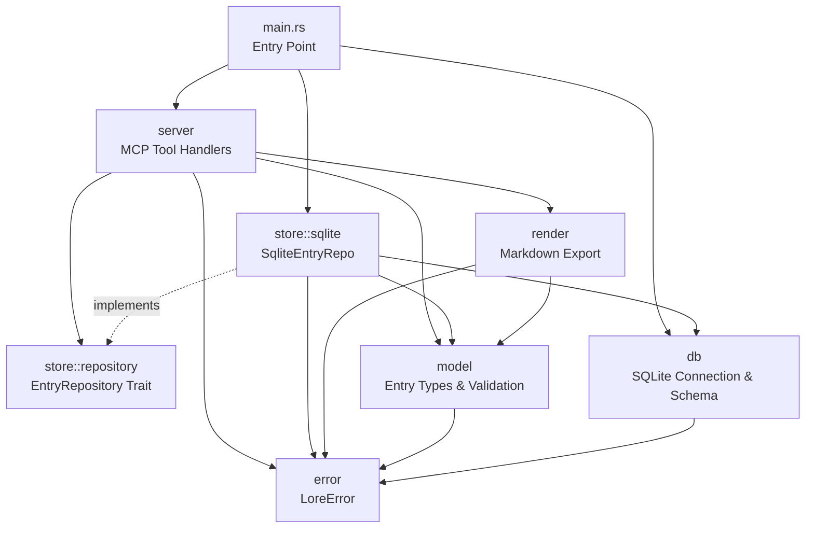
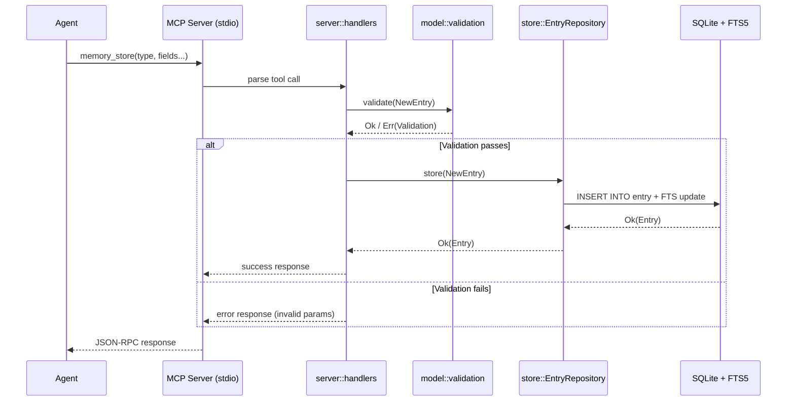
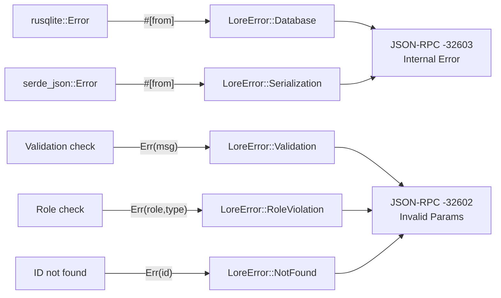
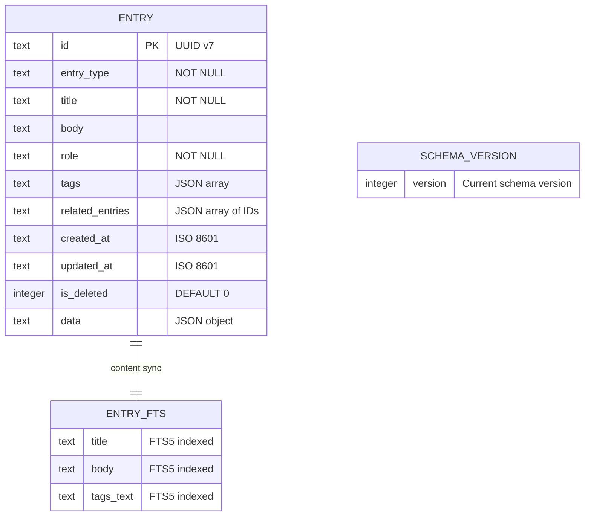

# Lorekeeper — Architecture

> **Technical Source of Truth** for the Lorekeeper project.
> Last updated: 2026-03-13

---

## Project Overview

**Lorekeeper** is a Rust MCP (Model Context Protocol) server that provides
structured long-term memory for AI coding agents. It replaces flat-file history
(`context.md`) with a queryable SQLite database, enabling agents to store, search,
and retrieve typed memory entries via MCP tools over stdio.

The system wraps SQLite with FTS5 full-text search, enforces TARS role boundaries
(Architect vs Builder) mechanically, and supports selective retrieval to minimize
context window consumption.

---

## Project Objectives & Key Features

### Primary Objectives

- **Eliminate context bloat** — reduce per-session token load from ~36K tokens
  (flat file) to ~3.5K tokens (selective queries).
- **Enable structured recall** — typed entries with required fields replace
  unstructured prose. Constraints, decisions, and plans are first-class objects.
- **Enforce workflow discipline** — role-based write permissions prevent
  accidental TARS phase violations (Builder can't write DECISIONs; Architect
  can't write COMMITs).
- **Support cross-session continuity** — persistent entries survive context
  window resets. Agents query what they need instead of loading everything.

### Key Features

- **10 typed entry types** (DECISION, COMMIT, CONSTRAINT, LESSON, PLAN, FEATURE,
  STUB, DEFERRED, BUILDER_NOTE, TECH_DEBT) with type-specific validation.
- **FTS5 full-text search** across titles, bodies, and tags.
- **11 MCP tools** (4 write, 5 read, 2 meta) for complete CRUD + search + analytics.
- **Role enforcement** — server validates `role` field on every write operation.
- **Markdown export** — `memory_render` generates human-readable output for review.
- **Per-project database** — isolated `.lorekeeper/memory.db` per project root.

### Target Users

- AI coding agents operating under the TARS protocol.
- Human developers reviewing agent history via rendered markdown.

### Non-Goals

- **Vector/semantic search** — FTS5 keyword search covers the use case. Vectors
  may be added later but are out of initial scope.
- **Multi-user authentication** — this is a local tool, not a shared service.
  Role is self-reported by the calling agent.
- **Web UI** — memory is accessed via MCP tools and markdown exports only.
- **Real-time sync** — no multi-process concurrent access. One agent session at
  a time.

---

## Language & Runtime

| Item                 | Value                              |
|:---------------------|:-----------------------------------|
| **Language**         | Rust                               |
| **Edition**          | 2024                               |
| **Rust Version**     | 1.93.1+ (stable)                  |
| **Async Runtime**    | Tokio (required by `rust-mcp-sdk`) |
| **MSRV**             | 1.85.0 (Edition 2024 minimum)     |
| **Target Platform**  | Windows x86_64 (primary), Linux x86_64 (secondary) |

---

## Project Layout

```
lorekeeper/
├── Cargo.toml              # Package manifest, workspace lints
├── rustfmt.toml            # Formatter configuration
├── architecture.md         # This document
├── .gitignore
├── .agent/                 # TARS workflow definitions and rules
│   ├── workflows/
│   ├── scripts/
│   └── rules/
├── src/
│   ├── main.rs             # Entry point: bootstrap MCP server, discover project root
│   ├── lib.rs              # Crate root: re-exports, module docs
│   ├── error.rs            # LoreError enum (thiserror)
│   ├── render.rs           # Markdown export (memory_render)
│   ├── model/
│   │   ├── mod.rs          # Re-exports
│   │   ├── entry.rs        # Entry, NewEntry, UpdateEntry structs
│   │   ├── types.rs        # EntryType enum, type-specific data structs
│   │   └── validation.rs   # Type-specific field validation, role enforcement
│   ├── db/
│   │   ├── mod.rs          # Database connection, WAL mode init
│   │   └── schema.rs       # DDL: CREATE TABLE, FTS5 virtual table, triggers
│   ├── store/
│   │   ├── mod.rs          # Re-exports
│   │   ├── repository.rs   # EntryRepository trait definition
│   │   └── sqlite.rs       # SqliteEntryRepo — concrete implementation
│   └── server/
│       ├── mod.rs          # MCP server setup, tool registration
│       └── mod.rs          # MCP server setup, tool registration
└── .lorekeeper/            # User data directory (managed by main)
    └── memory.db           # SQLite database file
```

---

## Module Boundaries

### `model` — Domain Types

- **Owns:** `Entry`, `NewEntry`, `UpdateEntry`, `EntryType`, type-specific data
  structs (`PlanData`, `CommitData`, etc.), `EntryId` newtype, validation logic,
  role enforcement rules.
- **Does NOT Own:** Database access, serialization format, MCP protocol details.
- **Trait Interfaces:** None (leaf module — used by all other modules).
- **Mock Availability:** No mocking needed — pure data types and validation functions.

### `db` — Database Lifecycle

- **Owns:** SQLite connection creation, WAL mode initialization, schema DDL
  (CREATE TABLE, FTS5 virtual table, sync triggers), schema versioning.
- **Does NOT Own:** Business logic, entry validation, query building for search.
- **Trait Interfaces:** None (provides `rusqlite::Connection` directly to store).
- **Mock Availability:** Not mocked — tests use in-memory SQLite (`":memory:"`).

### `store` — Entry Repository

- **Owns:** CRUD operations on entries, FTS5 search queries, tag normalization,
  pagination, soft-delete filtering, stats aggregation.
- **Does NOT Own:** Database connection lifecycle, entry validation (delegated to
  `model`), MCP protocol handling.
- **Trait Interfaces:**
  - `EntryRepository` — trait defining all storage operations.
  - `SqliteEntryRepo` — concrete implementation.
- **Mock Availability:** `EntryRepository` trait enables mocking via `mockall` for
  testing server handlers without SQLite.

### `server` — MCP Tool Handlers

- **Owns:** MCP server bootstrap, tool registration (11 tools), request parsing,
  response formatting, JSON-RPC error mapping.
- **Does NOT Own:** Storage logic, validation, database access.
- **Trait Interfaces:** Depends on `EntryRepository` trait (injected).
- **Mock Availability:** Server itself is not mocked. Its dependency
  (`EntryRepository`) is mocked for isolated handler testing.

### `render` — Markdown Export

- **Owns:** Formatting entries into grouped, chronological markdown output.
- **Does NOT Own:** Entry retrieval (receives data from caller), storage.
- **Trait Interfaces:** None (pure function: entries in, markdown string out).
- **Mock Availability:** Not needed — pure transformation, tested directly.

### `error` — Error Types

- **Owns:** `LoreError` enum with variants for all failure modes.
- **Does NOT Own:** Error recovery logic (handled by callers).
- **Trait Interfaces:** Implements `From` conversions for `rusqlite::Error`,
  `serde_json::Error`, `uuid::Error`.
- **Mock Availability:** Not applicable.

---

## Dependency Direction Rules

| Module   | May Import                            | Must NOT Import              |
|:---------|:--------------------------------------|:-----------------------------|
| `server` | `store` (trait), `model`, `render`, `error` | `db`                   |
| `store`  | `db`, `model`, `error`                | `server`, `render`           |
| `render` | `model`, `error`                      | `server`, `store`, `db`      |
| `model`  | `error`                               | `server`, `store`, `db`, `render` |
| `db`     | `error`                               | `server`, `store`, `model`, `render` |
| `error`  | *(leaf — no internal imports)*        | Everything                   |

```
  server
    │
    ├──▶ store (trait)
    │       │
    │       ├──▶ db
    │       │
    │       └──▶ model ──▶ error
    │
    ├──▶ render ──▶ model
    │
    └──▶ error
```

Direction is acyclic. Infrastructure (`db`) is at the bottom. Entry point
(`server`) is at the top. `model` and `error` are shared leaf modules.

---

## Toolchain

| Tool        | Command                                                            |
|:------------|:-------------------------------------------------------------------|
| **Format**  | `cargo fmt --all -- --check`                                       |
| **Lint**    | `cargo clippy --all-targets --all-features -- -D warnings`         |
| **Test**    | `cargo test --all-features`                                        |
| **Build**   | `cargo build`                                                      |
| **Doc**     | `cargo doc --no-deps --all-features`                               |
| **Run**     | `cargo run` (starts MCP server on stdio)                           |

### Verification Pipeline

```sh
cargo fmt --all -- --check
cargo clippy --all-targets --all-features -- -D warnings
cargo test --all-features
```

All three must exit with code 0 before any commit.

---

## Error Handling Strategy

### Error Type

Single crate-level error enum using `thiserror`:

```
LoreError
├── Database(rusqlite::Error)        — SQLite failures
├── Validation(String)               — Missing/invalid fields
├── NotFound(EntryId)                — Entry ID doesn't exist
├── RoleViolation { role, entry_type } — Unauthorized write attempt
├── Serialization(serde_json::Error) — JSON parse/emit failures
└── ProjectRoot(String)              — Can't determine project root
```

### Error Flow

1. `model::validation` returns `Result<(), LoreError::Validation>`.
2. `store::sqlite` maps `rusqlite::Error` → `LoreError::Database` via `#[from]`.
3. `server::handlers` maps `LoreError` → MCP JSON-RPC error responses:
   - `Validation` / `RoleViolation` → error code `-32602` (Invalid params)
   - `NotFound` → error code `-32602` (Invalid params)
   - `Database` / `Serialization` → error code `-32603` (Internal error)

All errors include a human-readable message in the JSON-RPC error `data` field.

---

## Observability & Logging

| Framework   | Crate                       |
|:------------|:----------------------------|
| Logging     | `tracing`                   |
| Subscriber  | `tracing-subscriber` + `EnvFilter` |

> [!CAUTION]
> **stdout is reserved for MCP JSON-RPC protocol messages.** All tracing output
> MUST go to stderr. Configure the subscriber with `.with_writer(std::io::stderr)`.

### Log Levels

| Level   | Use                                              |
|:--------|:-------------------------------------------------|
| `error` | Database failures, schema corruption             |
| `warn`  | Validation rejections, role violations            |
| `info`  | Tool invocations, entry counts, startup/shutdown |
| `debug` | SQL queries, JSON payloads                        |
| `trace` | FTS5 query building, field-level validation       |

### Configuration

Log level controlled via `LOREKEEPER_LOG` environment variable.
Default: `info`. Parsed by `EnvFilter` at startup.

---

## Testing Strategy

### Unit Tests

- **Location:** `#[cfg(test)] mod tests` in each source file.
- **Database:** In-memory SQLite (`":memory:"`) — no files, no cleanup.
- **Mocking:** `mockall` for `EntryRepository` trait in handler tests.
- **Naming:** `<action>_<scenario>_<expected>`.

### Integration Tests

- **Location:** `tests/` directory at crate root.
- **Scope:**
  - `store_tests.rs` — full CRUD + search + pagination against temp SQLite file.
  - `validation_tests.rs` — all 10 entry types × valid/invalid inputs.
  - `server_tests.rs` — MCP tool handlers with mocked repository.
- **Fixtures:** `tests/common/mod.rs` provides `setup_test_db()` helper.

### Coverage Expectations

| Metric                     | Target  |
|:---------------------------|:--------|
| Public function coverage   | 100%    |
| Line coverage              | ≥ 90%   |
| Entry type validation      | 100% (all 10 types, happy + error paths) |
| Role enforcement           | 100% (all type × role combinations) |

---

## Documentation Conventions

- All public items get `///` doc comments with summary, `# Errors`, and `# Examples`.
- `lib.rs` and each `mod.rs` get `//!` module-level docs.
- Inline comments for non-obvious logic (e.g., FTS5 trigger SQL).
- `cargo doc --no-deps` must produce zero warnings.

---

## Dependencies & External Systems

### Rust Crates

| Crate                | Purpose                               | Feature Flags     |
|:---------------------|:--------------------------------------|:------------------|
| `rust-mcp-sdk`       | MCP protocol (server, stdio transport)| —                 |
| `rusqlite`           | SQLite access                         | `bundled`         |
| `uuid`               | UUID v7 generation                    | `v7`              |
| `serde`              | Serialization framework               | `derive`          |
| `serde_json`         | JSON parsing/emitting                 | —                 |
| `thiserror`          | Error derive macros                   | —                 |
| `tracing`            | Structured logging                    | —                 |
| `tracing-subscriber` | Log output and filtering              | `env-filter`      |
| `chrono`             | Timestamp handling (ISO 8601)         | `serde`           |
| `tokio`              | Async runtime                         | `full`            |

### Dev Dependencies

| Crate     | Purpose                    |
|:----------|:---------------------------|
| `mockall` | Mock generation for traits |
| `tempfile`| Temp directories for test DBs |

### External Systems

| System  | Role          | Access Pattern              |
|:--------|:--------------|:----------------------------|
| SQLite  | Embedded DB   | Direct file via `rusqlite`  |
| Filesystem | DB storage | `.lorekeeper/memory.db`     |

No network dependencies. No external APIs. No Docker services.

---

## Architecture Diagrams

### Module Interaction



### Data Flow



### Error Propagation



---

## Known Constraints & Technical Debt

| Constraint | Impact | Mitigation |
|:-----------|:-------|:-----------|
| **stdout reserved for MCP** | All logging must go to stderr | Configure tracing subscriber writer |
| **Windows non-admin** | Can't install system packages | `rusqlite` bundled feature compiles SQLite from C source (needs MSVC) |
| **Single-session access** | No concurrent multi-agent writes | SQLite WAL mode handles reader/writer concurrency; true multi-agent would need locking |
| **Honor-system role enforcement** | Agent self-reports role | Acceptable — prevents accidental violations, not adversarial attacks |
| **FTS5 tokenizer is rebuild-to-change** | Changing tokenizer requires re-indexing | Choose conservatively: `unicode61` with `remove_diacritics=2` |
| **No vector search** | Keyword-only retrieval | FTS5 covers 90%+ of use cases; vectors deferred to future phase |

---

## Data Model

### `entry` Table

| Column           | Type    | Constraints         | Notes |
|:-----------------|:--------|:--------------------|:------|
| `id`             | TEXT    | PK                  | UUID v7 (time-ordered) |
| `entry_type`     | TEXT    | NOT NULL            | One of 10 type discriminators |
| `title`          | TEXT    | NOT NULL            | Summary line |
| `body`           | TEXT    |                     | Extended content (nullable) |
| `role`           | TEXT    | NOT NULL            | `architect` or `builder` |
| `tags`           | TEXT    |                     | JSON array, lowercase-normalized |
| `related_entries`| TEXT    |                     | JSON array of entry IDs |
| `created_at`     | TEXT    | NOT NULL            | ISO 8601 UTC, auto-set |
| `updated_at`     | TEXT    | NOT NULL            | ISO 8601 UTC, auto-set on mutation |
| `is_deleted`     | INTEGER | NOT NULL DEFAULT 0  | Soft delete flag |
| `data`           | TEXT    |                     | JSON object — type-specific fields |

### Type-Specific `data` Fields

| Entry Type     | `data` JSON Fields                          | Role Restriction |
|:---------------|:--------------------------------------------|:-----------------|
| `DECISION`     | *(empty — title+body+tags suffice)*         | Architect only   |
| `COMMIT`       | `{ hash, files[] }`                         | Builder only     |
| `CONSTRAINT`   | `{ source }`                                | Architect only   |
| `LESSON`       | `{ root_cause }`                            | Architect only   |
| `PLAN`         | `{ scope, tier, status }`                   | Architect only   |
| `FEATURE`      | `{ status }`                                | Architect only   |
| `STUB`         | `{ phase_number, contract, module, status }`| Builder writes   |
| `DEFERRED`     | `{ reason, target_phase }`                  | Both             |
| `BUILDER_NOTE` | `{ note_type, step_ref, plan_ref }`         | Builder only     |
| `TECH_DEBT`    | `{ severity, origin_phase }`                | Both             |

### `entry_fts` Virtual Table (FTS5)

```sql
CREATE VIRTUAL TABLE entry_fts USING fts5(
    title,
    body,
    tags_text,
    content='entry',
    content_rowid='rowid',
    tokenize='unicode61 remove_diacritics 2'
);
```

Synchronized via triggers on `entry` INSERT, UPDATE, DELETE.
`tags_text` is a flattened space-separated version of the `tags` JSON array.

### `schema_version` Table

| Column    | Type    | Notes |
|:----------|:--------|:------|
| `version` | INTEGER | Current schema version number |

Checked at startup. If below expected version, migrations run sequentially.

### Entity-Relationship Diagram



### Migration Strategy

- **Tool:** Hand-written SQL, executed by Rust code at startup.
- **Versioning:** `schema_version` table tracks current version.
- **Process:** On startup, compare `schema_version.version` against compiled-in
  `LATEST_VERSION`. Run migration functions sequentially for each gap.
- **Rollback:** Each migration must have a documented rollback SQL, but rollback
  is manual (not auto-executed). Backup before migration.
- **Naming convention in code:** `migrate_v1_to_v2()`, `migrate_v2_to_v3()`, etc.

### Naming Conventions

- `snake_case` for tables and columns.
- Singular table names (`entry`, not `entries`).
- JSON field names within `data` use `snake_case`.

---

## Environment Configuration

Lorekeeper has minimal configuration — it's a local embedded tool, not a network
service.

### Environment Variables

| Variable           | Type   | Required | Default           | Notes |
|:-------------------|:-------|:--------:|:------------------|:------|
| `LOREKEEPER_ROOT`  | Path   | ❌       | Auto-discover     | Project root override. Fallback: walk up from CWD to find `.git` or `.lorekeeper/` |
| `LOREKEEPER_LOG`   | String | ❌       | `info`            | tracing `EnvFilter` value (e.g., `debug`, `lorekeeper=trace`) |

### Project Root Discovery

1. Check `LOREKEEPER_ROOT` env var → use if set.
2. Walk up from CWD looking for `.lorekeeper/` directory → use parent.
3. Walk up from CWD looking for `.git` directory → use parent.
4. Fail with `LoreError::ProjectRoot` if none found.

### Database File Location

```
<project_root>/.lorekeeper/memory.db
```

Directory created automatically on first run. Added to `.gitignore`.

---

## MCP Tool Reference

### Write Tools

| Tool | Parameters | Validation |
|:-----|:-----------|:-----------|
| `lorekeeper_store` | `type`, `title`, `body?`, `role`, `tags?`, `related_entries?`, `data?` | Required fields per type, role permissions, UUID validation |
| `lorekeeper_update` | `id`, `title?`, `body?`, `tags?`, `related_entries?`, `data?` | Entry must exist, state machine enforcement, UUID validation |
| `lorekeeper_delete` | `id` | Entry must exist, sets `is_deleted=1` |

### Read Tools

| Tool | Parameters | Returns |
|:-----|:-----------|:--------|
| `lorekeeper_search` | `query`, `type?`, `limit?` (default: 20) | FTS5 ranked results |
| `lorekeeper_recent` | `n` (default: 10) | Last N entries by UUID v7 order |
| `lorekeeper_by_type` | `type`, `status?`, `limit?` (default: 50), `offset?` | Filtered entries |
| `lorekeeper_stats` | — | Counts per type, last-updated |
| `lorekeeper_render` | `format?` (default: `markdown`) | Full memory dump grouped by type |

### Meta Tools

| Tool | Parameters | Returns |
|:-----|:-----------|:--------|
| `lorekeeper_help` | `topic` | Detailed guidance on entry types, roles, workflow |
