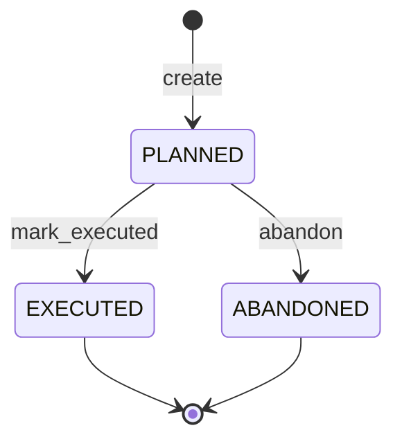
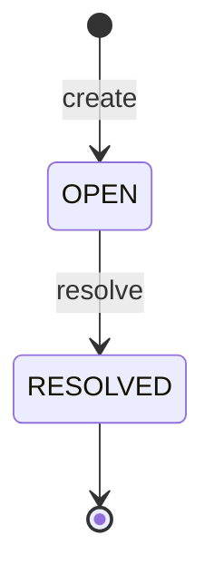

# Behavioral Specification

| Field | Value |
|-------|-------|
| **Project** | Lorekeeper |
| **Version** | 3 |
| **Last Updated** | 2026-03-18 |

> Last verified against: `0f65e6b` (2026-03-18, v0.3.3)

---

## 1. Domain Models & Constraints (`model`)

> Defines the core entity representations, type-specific validation rules, and mechanical role enforcement.

### `Entry`

| Field | Type | Constraints | Default | Notes |
|-------|------|-------------|---------|-------|
| `id` | `EntryId` | PK, UUID v7 | Auto-generated | Time-ordered semantic |
| `entry_type` | `EntryType` | NOT NULL | — | Enum of 11 supported types |
| `title` | `String` | NOT NULL, non-empty | — | First line of COMMIT message |
| `body` | `Option<String>` | | `None` | Nullable if title suffices |
| `role` | `String` | NOT NULL, restricted | — | Must be "architect" or "builder" |
| `tags` | `Vec<String>` | | `[]` | Normalized to lowercase on insert |
| `related_entries`| `Vec<EntryId>` | | `[]` | Foreign keys loosely enforced |
| `created_at` | `DateTime<Utc>`| NOT NULL, immutable | `now()` | Set once |
| `updated_at` | `DateTime<Utc>`| NOT NULL | `now()` | Updated on every mutation |
| `is_deleted` | `bool` | NOT NULL | `false` | Soft delete marker |
| `data` | `Value` | Type-specific struct | `{}` | JSON-serialized domain struct |

### Validation Rules

[ERROR] Missing required top-level field
GIVEN a new entry payload missing the `title` field
WHEN the entry is validated
THEN validation fails with `ValidationError::MissingField("title")`

[ERROR] Type-specific data validation failure
GIVEN a `PLAN` entry missing the `status` field in its `data` JSON
WHEN the entry is validated
THEN validation fails with `ValidationError::InvalidData("PLAN requires status")`

[ERROR] Malformed foreign key reference
GIVEN an entry with a `related_entries` array containing an invalid UUID string
WHEN the entry is validated
THEN validation fails with `ValidationError::InvalidIdFormat`

### Role Enforcement

[ERROR] Builder attempts to write Architect-only entry
GIVEN an MCP tool call executed under the `role: "builder"`
WHEN attempting to store or update a `DECISION` entry
THEN validation fails with `RoleViolation { role: "builder", entry_type: "DECISION" }`

[ERROR] Architect attempts to write Builder-only entry
GIVEN an MCP tool call executed under the `role: "architect"`
WHEN attempting to store or update a `COMMIT` entry
THEN validation fails with `RoleViolation { role: "architect", entry_type: "COMMIT" }`

[HAPPY] Dual-role entry type
GIVEN an MCP tool call executed under the `role: "builder"`
WHEN attempting to store a `DEFERRED` entry
THEN validation succeeds

---

## 2. State Machines (`model`)

> Defines valid transitions for stateful entry data fields.

### `PlanStatus`

| From | To | Trigger | Side Effects |
|------|----|---------|--------------|
| — | PLANNED | `lorekeeper_store(type="PLAN")` | Entry inserted |
| PLANNED | EXECUTED | `lorekeeper_update()` | `updated_at` refreshed |
| PLANNED | ABANDONED | `lorekeeper_update()` | `updated_at` refreshed |
| EXECUTED | PLANNED | INVALID | Cannot revert execution |

### `StubStatus`

| From | To | Trigger | Side Effects |
|------|----|---------|--------------|
| — | OPEN | `lorekeeper_store(type="STUB")` | Expected phase registered |
| OPEN | RESOLVED | `lorekeeper_update()` | `updated_at` refreshed |

---

## 3. Entry Repository (`store`)

> Manages persistence, search, and retrieval of entries via SQLite.

### Public API (Trait: `EntryRepository`)

| Function | Signature | Returns | Errors |
|----------|-----------|---------|--------|
| `store` | `(&self, input: NewEntry) -> Result<Entry>` | `Entry` | `Database`, `Validation` |
| `get` | `(&self, id: &str) -> Result<Entry>` | `Entry` | `NotFound` |
| `update` | `(&self, id: &str, update: UpdateEntry) -> Result<Entry>` | `Entry` | `Database`, `Validation`, `NotFound` |
| `delete` | `(&self, id: &str) -> Result<()>` | `()` | `Database`, `NotFound` |
| `search` | `(&self, query: &SearchQuery) -> Result<Vec<Entry>>` | `Vec<Entry>` | `Database` |
| `recent` | `(&self, limit: u32) -> Result<Vec<Entry>>` | `Vec<Entry>` | `Database` |
| `by_type` | `(&self, entry_type: EntryType, filters: &Filters) -> Result<Vec<Entry>>` | `Vec<Entry>` | `Database` |
| `stats` | `(&self) -> Result<MemoryStats>` | `MemoryStats` | `Database` |
| `render_all` | `(&self) -> Result<Vec<Entry>>` | `Vec<Entry>` | `Database` |

### Behavioral Scenarios

[HAPPY] Partial update execution
GIVEN an existing entry with `title="Old"`, `tags=["A"]`, and `data={"tier":"S"}`
WHEN `update` is called with `UpdateEntry { title: None, tags: Some(["B"]), data: Some({"tier":"A"}) }`
THEN the updated entry has `title="Old"`, `tags=["B"]`, and `data={"tier":"A"}`
AND its `updated_at` timestamp is newer than `created_at`
AND the FTS5 index reflects the new tags

[HAPPY] Tag normalization
GIVEN a `NewEntry` with `tags=["Auth ", "DESIGN"]`
WHEN `store` is successfully executed
THEN the resulting `Entry` has `tags=["auth", "design"]`

[HAPPY] Time-ordered retrieval
GIVEN 3 entries stored sequentially
WHEN `recent(limit=2)` is called
THEN the 2 most recently created entries are returned
AND they are ordered descending by `id` (UUID v7)

[EDGE] Updating a soft-deleted entry
GIVEN an entry that has been deleted (`is_deleted=true`)
WHEN `update` is called for that entry's ID
THEN the operation fails with `NotFoundError`

[EDGE] Searching excludes soft-deleted entries
GIVEN an entry containing the word "critical"
AND the entry has been deleted
WHEN `search` is called with the query "critical"
THEN the deleted entry is not included in the results

### Invariants

- `tags` arrays are always lowercase and trimmed.
- The FTS5 string representation (`tags_text`) exactly matches the JSON array elements separated by spaces.
- Database writes (store/update/delete) are fully transactional.
- `update_at` is monotonically increasing for a given entry.

### Required Test Coverage

- [ ] Repository: Create, Retrieve by ID, Update (partial + full), Soft Delete
- [ ] Read queries: Filter by type, Filter by status, Limit/Offset pagination
- [ ] Search: FTS5 matching on title, body, and tags
- [ ] Edge cases: Non-existent IDs, invalid status values in Filters

---

## 4. MCP Server & Integration (`server`)

> Protocol boundary exposing the repository over JSON-RPC 2.0 via stdio.

### MCP Tools Interface

| Tool Name | Parameters | Returns Format |
|-----------|------------|----------------|
| `lorekeeper_update` | `id`, `title?`, `body?`, `tags?`, `related_entries?`, `data?` | JSON Object (Serialized `Entry`) |
| `lorekeeper_delete` | `id` | JSON Object `{ status: success }` |
| `lorekeeper_render` | `format?` (markdown, default) | Markdown Text |
| `lorekeeper_get` | `id` | JSON Object (Serialized `Entry`) |
| `lorekeeper_search` | `query`, `entry_type?`, `limit?` | JSON Array of `Entry` |
| `lorekeeper_recent` | `limit?` | JSON Array of `Entry` |
| `lorekeeper_by_type` | `entry_type`, `status?`, `limit?`, `offset?` | JSON Array of `Entry` |
| `lorekeeper_stats` | (none) | JSON Object (type counts, last_updated) |
| `lorekeeper_reflect` | `focus?`, `limit?`, `stale_days?`, `min_access_count?` | JSON Object (stale, dead, hot, orphaned, contradictions, coverage_gaps, lonely) |
| `lorekeeper_store` | `entry_type`, `role`, `title`, `body?`, `tags?`, `related_entries?`, `data?` | JSON Object `{ status: success, id: uuid, suggestions?: [] }` |
| `lorekeeper_set_root` | `path` | JSON Object `{ status: success, root, entries }` |
| `lorekeeper_help` | `topic?` | Markdown help text |

### Behavioral Scenarios

[HAPPY] Successful tool invocation
GIVEN a valid JSON-RPC 2.0 request to `lorekeeper_recent`
WHEN the server processes the request
THEN a valid JSON-RPC response is returned over stdout
AND the result contains the serialized `Vec<Entry>`

[ERROR] Request validation failure maps to Invalid Params
GIVEN an MCP tool call to `lorekeeper_store` that fails domain validation (e.g. missing title)
WHEN the server processes the request
THEN a JSON-RPC error response is returned
AND the error code is `-32602` (Invalid Params)
AND the error message indicates the exact validation failure

[ERROR] Data layer failure maps to Internal Error
GIVEN an MCP tool call that encounters an SQLite constraint violation
WHEN the server processes the request
THEN a JSON-RPC error response is returned
AND the error code is `-32603` (Internal Error)
AND an `error!` trace event is emitted to stderr

[SECURITY] Stdio separation
GIVEN the MCP server is initialized
WHEN any `tracing` event is emitted
THEN the log output is written to stderr
AND stdout remains strictly preserved for JSON-RPC JSON payloads

[HAPPY] Set root switches active project
GIVEN the MCP server is running (with or without a project root)
WHEN `lorekeeper_set_root` is called with a valid directory path
THEN the server switches its database to `<path>/.lorekeeper/memory.db`
AND the response contains `{ status: "success", root: "<path>", entries: N }`
AND subsequent tool calls operate on the new project's database

[ERROR] Set root with invalid path
GIVEN the MCP server is running
WHEN `lorekeeper_set_root` is called with a non-existent directory
THEN the operation fails with an error indicating the path is invalid
AND the previously active project root (if any) remains unchanged

[ERROR] No-root guard rejects data-modifying tools
GIVEN the MCP server started without a project root (in-memory fallback)
AND `lorekeeper_set_root` has NOT been called
WHEN any data-modifying tool (e.g. `lorekeeper_store`, `lorekeeper_stats`) is invoked
THEN the tool call returns an error: "no project root set — call lorekeeper_set_root first"
AND `lorekeeper_set_root` and `lorekeeper_help` remain functional

[HAPPY] Reflect detects coverage gaps
GIVEN a memory bank containing only `DECISION` entries
WHEN `lorekeeper_reflect` is called with `focus: "coverage_gaps"`
THEN the report's `summary.coverage_gaps` is ≥ 1
AND each missing `EntryType` appears as a finding with `category: "coverage_gaps"`

[HAPPY] Reflect detects lonely entries
GIVEN entries A and B where A has `related_entries: []` and B has `related_entries: [A.id]`
WHEN `lorekeeper_reflect` is called with `focus: "lonely"`
THEN entry A appears as a finding with `category: "lonely"`
AND entry B does NOT appear in the findings

[HAPPY] Store returns contextual suggestions
GIVEN a valid `lorekeeper_store` call with `entry_type: "DECISION"`
WHEN the entry is successfully stored
THEN the response includes a `suggestions` array with actionable guidance
AND the suggestions reference `lorekeeper_reflect` and `lorekeeper_update`

[EDGE] Store omits suggestions for non-key types
GIVEN a valid `lorekeeper_store` call with `entry_type: "DEFERRED"`
WHEN the entry is successfully stored
THEN the response does NOT include a `suggestions` field (or it is empty)

---

## 5. Database Lifecycle (`db`)

> Initializes the SQLite database and handles schema migrations.

### Behavioral Scenarios

[HAPPY] First run initialization
GIVEN no `.lorekeeper` directory exists in the project root
WHEN the server starts
THEN the `.lorekeeper` directory is created
AND `memory.db` is initialized
AND the schema and FTS5 virtual tables are created
AND `WAL` journaling mode is enabled

[HAPPY] Graceful no-root startup
GIVEN no `LOREKEEPER_ROOT` environment variable is set
AND the server's working directory does not contain a `.git` or `.lorekeeper` directory
WHEN the server starts
THEN it does NOT crash or exit with an error
AND it initializes with an in-memory SQLite database
AND it logs that no project root was found
AND the no-root guard is active (data-modifying tools are blocked until `lorekeeper_set_root` is called)

[HAPPY] Automatic schema migration
GIVEN an existing `memory.db` on schema version 1
AND the server requires schema version 2
WHEN the server starts
THEN the `migrate_v1_to_v2` migration is executed transactionally
AND the `schema_version` table is updated to 2

[EDGE] Database lock timeout
GIVEN another process holding an exclusive write lock on `memory.db`
WHEN the server attempts to write to the database
THEN the operation fails with `DatabaseError(SqliteFailure(Locked))` after the busy timeout expires
